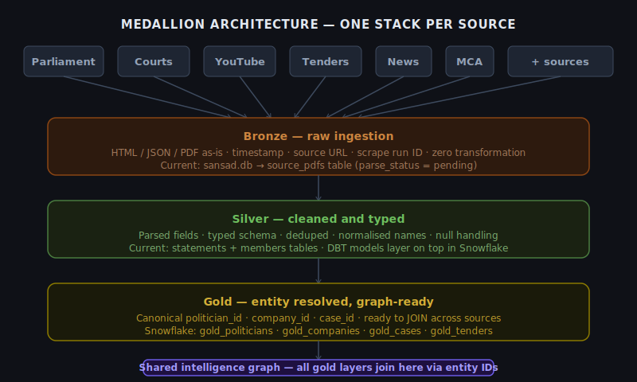
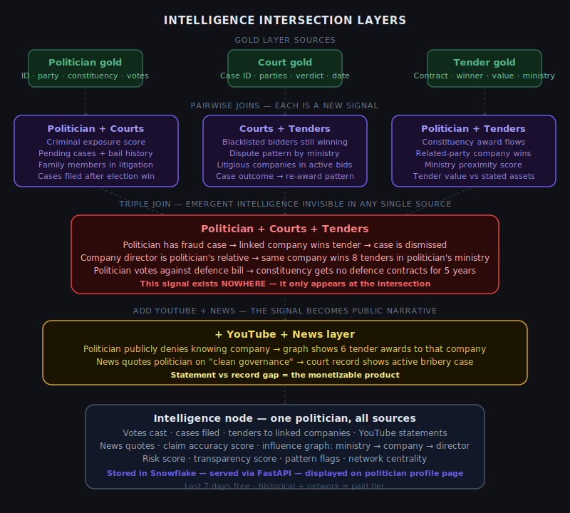
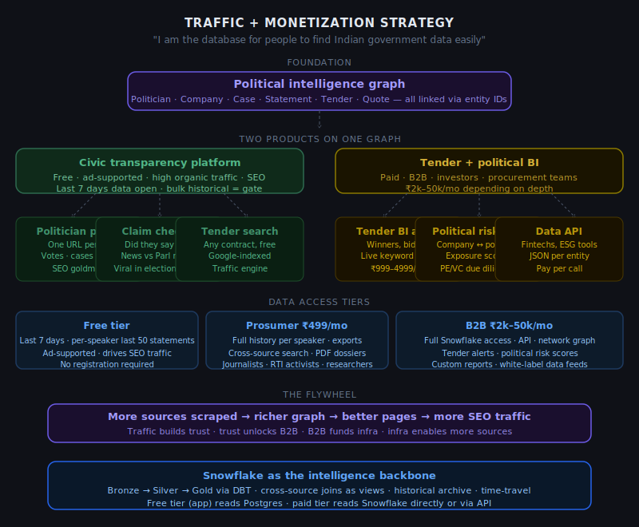
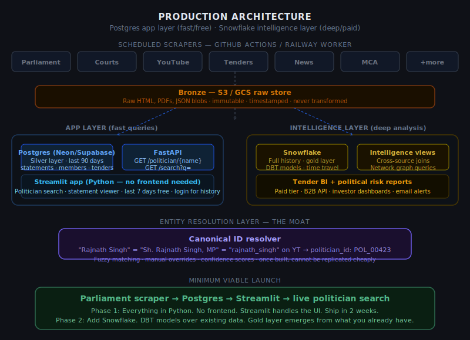

# ParamaSrota — Architecture & Strategy

> "I should be the database for people to find Indian government data easily."

This document covers the full architecture vision for ParamaSrota — from the current parliament scraper to a production political intelligence graph.

---

## 1. Medallion Architecture per Source

Each data source (Parliament, Courts, YouTube, Tenders, News, MCA) gets its own independent Bronze → Silver → Gold medallion stack using the same pluggable adapter pattern.



### Layers

| Layer | What it stores | Where |
|-------|---------------|-------|
| **Bronze** | Raw HTML, PDFs, JSON — untouched | S3 / GCS |
| **Silver** | Parsed, typed, deduped, normalised | Postgres (recent) + Snowflake (historical) |
| **Gold** | Entity-resolved, canonical IDs, JOIN-ready | Snowflake — DBT models |

**Current state:** The parliament scraper already implements this pattern. `source_pdfs` = bronze. `statements` + `members` = silver. Gold layer is the next build step — entity resolution that produces `politician_id`, `company_id`, `case_id` across sources.

---

## 2. Intelligence Intersection Layers

The exponential value comes from cross-source joins. Each pairwise join creates new intelligence invisible in any single source. Triple joins produce emergent signals.



### Pairwise joins

| Join | What emerges |
|------|-------------|
| Politician + Courts | Criminal exposure score, pending cases, family litigation |
| Courts + Tenders | Blacklisted companies still winning, ministry dispute patterns |
| Politician + Tenders | Constituency award flows, related-party wins, ministry proximity score |

### Triple join

`Politician + Courts + Tenders` → signals that exist **nowhere else**:
- Politician has fraud case → linked company wins tender → case dismissed
- Company director is politician's family → wins 8 tenders in that politician's ministry

### Adding YouTube + News

Adds the **narrative layer**:
- Politician publicly denies knowing company → graph shows 6 tender awards to them
- News quotes politician on "clean governance" → court shows active bribery case
- Statement vs record gap = the monetizable product

---

## 3. Traffic & Monetization Strategy



### The core positioning

> Not a news site. Not a BI tool. The Google for Indian government data.

Every politician, every company that won a tender, every court case → its own URL, indexed by Google. Millions of pages targeting real searches people already make.

### Data access tiers

| Tier | What's included | Revenue model |
|------|----------------|---------------|
| **Free** | Last 7 days · per-speaker last 50 statements | Ad revenue (Google AdSense) |
| **Prosumer ₹499/mo** | Full history · cross-source search · PDF exports | Subscriptions |
| **B2B ₹2k–50k/mo** | Snowflake access · API · tender alerts · risk scores | SaaS + API billing |

### The flywheel

```
More sources → richer graph → better pages → more SEO traffic
→ traffic builds trust → trust unlocks B2B → B2B funds infra → more sources
```

### Fastest path to revenue

Tender alert emails. Sell directly to 10–20 infra/pharma companies via LinkedIn. No traffic needed. Charge ₹2,000–5,000/month per seat. Cash-flow positive before first SEO article.

---

## 4. Production Architecture



### Two-layer design

**App layer (Postgres + FastAPI + Streamlit)**
- Last 90 days of data
- Fast queries for the public-facing product
- Free tier lives here
- Streamlit = Python UI, no frontend skills needed

**Intelligence layer (Snowflake + DBT)**
- Full historical archive
- Gold layer with entity resolution
- Cross-source joins as Snowflake views
- Paid tier reads from here directly or via API
- DBT models transform silver → gold incrementally

### Entity resolution — the moat

```
"Rajnath Singh"           ← Parliament PDF
"Sh. Rajnath Singh, MP"   ← Court document  
"rajnath_singh"           ← YouTube channel
        ↓
politician_id: POL_00423  ← canonical ID in all joins
```

Once entity resolution is built across sources, no competitor can replicate the graph without rebuilding all the resolution work from scratch.

---

## 5. Scraper Framework Design

The current parliament scraper (`scraper.py`) establishes the pattern. Every new source is a new **adapter** plugged into the same framework:

```
Source Adapter
  └── fetch()          → raw HTML/PDF/JSON → S3
  └── parse()          → typed records → Postgres silver
  └── resolve()        → canonical entity IDs → Snowflake gold

Scheduler (GitHub Actions cron or Railway worker)
  └── runs each adapter on its own cadence
  └── dedup by hash before insert
  └── alerts on failure
```

### Confirmed sources and status

| Source | Status | Notes |
|--------|--------|-------|
| Parliament (eparlib) | ✅ Working | Session 1–6, 18th Lok Sabha |
| Courts (eCourts) | 🔲 Planned | Public API exists |
| YouTube | 🔲 Planned | YouTube Data API v3 |
| Tenders (GeM + CPPP) | 🔲 Planned | GeM has structured data |
| News | 🔲 Planned | RSS + scraping |
| MCA (company registry) | 🔲 Planned | MCA21 portal |

---

## 6. Minimum Viable Launch

```
Parliament scraper (existing)
      ↓
Postgres on Neon (free tier)
      ↓
FastAPI (3 endpoints)
      ↓
Streamlit app
      ↓
Deploy on Railway or Render
```

**Timeline: 2 weeks**

1. Migrate SQLite → Postgres (schema barely changes)
2. Wrap `query.py` logic in FastAPI
3. Build Streamlit UI over FastAPI
4. Deploy everything on Railway

**Then add Snowflake:**
1. Point bronze stage at S3
2. Set up Snowflake free trial
3. Write DBT models over existing `statements` data
4. Gold layer emerges from what you already have

---

## Current Codebase Status

| File | What it does | Production gap |
|------|-------------|----------------|
| `scraper.py` | Downloads PDFs from eparlib with probe logic | No monitoring/alerting; probe radius needs tuning as anchors age |
| `parser.py` | Regex speaker detection + statement extraction | Hindi skipped; multi-line names; topic extraction missing |
| `db.py` | SQLite schema — sessions, PDFs, statements, FTS5 | Migrate to Postgres; add party/photo to members |
| `query.py` | CLI search over statements | Wrap in FastAPI endpoints |
| `sessions_data.py` | Master session + sitting date registry | Add Rajya Sabha sessions |
| `main.py` | Orchestrates download + parse pipeline | Make it a proper DAG (Prefect or Airflow) |
